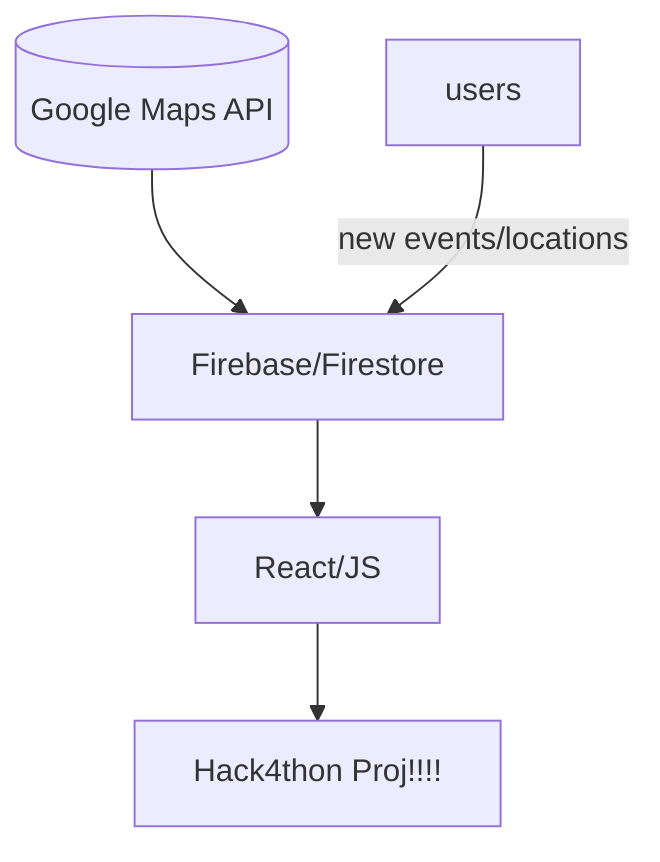

# Hack4thon Proj

##  Table of Contents

1. [Project Info](#project-info) 
2. [Tech Stack](#tech-stack)
3. [Running Project Locally](#running-project-locally)
4. [Points of Contact](#points-of-contact)
___

# Project Info
Welcome to Hack4thon-Proj! This project aims to create a platform through which members of the DMV community can find cultural spaces using Google Maps data/user moderated activity.

# Tech Stack
**Frontend:**

- Framework: React
- Language: JavaScript
- Styling: CSS Modules
- Libraries: 

**Backend:**
Database, and Hosting(?): [Firebase](https://firebase.google.com/)

**APIs:**
- Google Maps Places API
  

# Running Project Locally

run `npm start` from the hack4thon-proj directory!

# Points of Contact

For inquiries about the project, contact

| Name        | Email                  |
| ----------- | ---------------------- |
| Megan Yu | myu55@terpmail.umd.edu |
| Prakhar Gupta | pg12@terpmail.umd.edu|
| Annie Nguyen | annie251@terpmail.umd.edu |

---
Also semi contributing:
* Aastha Gautam
* Nitin Kanchinadam
* Stephen Wu
* Sophie Tsai

